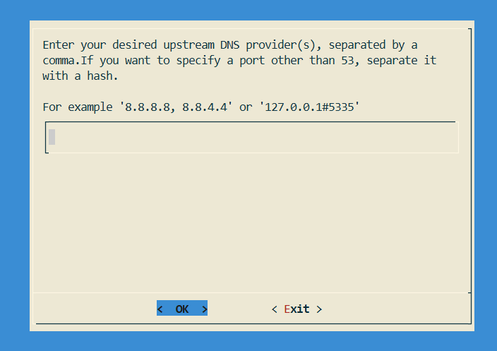

<div align="center">

# 🛡️ Pi-hole + Unbound + NetAlertX
### **One-Click DNS Security & Monitoring Stack**

[](https://github.com/TimInTech/Pi-hole-Unbound-PiAlert-Setup/actions)
[](LICENSE)
[](https://pi-hole.net/)
[](https://nlnetlabs.nl/projects/unbound/)
[](https://github.com/jokob-sk/NetAlertX)
[](https://debian.org/)
[](https://python.org/)
[](https://buymeacoffee.com/timintech)


**🌐 Sprachen:** 🇩🇪 Deutsch (diese Datei) • [🇬🇧 English](README.md)

</div>

---

## ✨ Features

✅ **Pi-hole Core 6.1.4 / FTL 6.1 / Web 6.2** – Eingebauter Webserver (kein lighttpd nötig)  
✅ **Zielplattform:** Raspberry Pi 3/4 (64-bit) mit Debian Bookworm/Trixie (inkl. Raspberry Pi OS)  
✅ **Ein-Klick-Installation** – Setup mit einem Befehl  
✅ **DNS-Sicherheit** – Pi-hole + Unbound mit DNSSEC (optional)  
✅ **Netzwerk-Monitoring** – NetAlertX Geräte-Tracking (optional)  
✅ **API-Monitoring** – Python FastAPI + SQLite (optional)  
✅ **Produktionsbereit** – Systemd-Hardening & Auto-Restart  
✅ **Idempotent** – Sicher mehrfach ausführbar  

> Getestet auf Raspberry Pi 3/4 (64-bit) unter Debian Bookworm/Trixie. Nutzt Pi-hole Core 6.1.4 / FTL 6.1 / Web 6.2 mit eingebautem Webserver – kein lighttpd nötig.

---

## ⚡ Ein-Klick-Schnellstart

```bash
git clone https://github.com/TimInTech/Pi-hole-Unbound-PiAlert-Setup.git
cd Pi-hole-Unbound-PiAlert-Setup
chmod +x install.sh
sudo ./install.sh
````

## ✅ Voraussetzungen

- Unterstützt: Debian/Ubuntu-Familie mit `apt-get` und `systemd`.
- Repo als normaler User klonen (kein `sudo git clone` / nicht aus einer root-Shell arbeiten).
- Installer via `sudo ./install.sh` ausführen (direkt als root wird absichtlich abgewiesen).

Der Installer schreibt:
- Logs: `/var/log/pihole-suite/install.log` und `/var/log/pihole-suite/install_errors.log`
- Suite-Env (API-Key): `/etc/pihole-suite/pihole-suite.env`

Wenn du Abhängigkeiten manuell installieren willst:

```bash
sudo apt-get update
sudo apt-get install -y git curl jq dnsutils iproute2 openssl python3 python3-venv python3-pip ca-certificates
```


## 🔴 ZWINGEND erforderlich: Pi-hole muss Unbound als Upstream nutzen

> ⚠️ **Achtung — diesen Schritt nicht überspringen.** Wenn Pi-hole nicht Unbound als Upstream nutzt, ist das Setup **fachlich kaputt** (DNSSEC/DoT werden umgangen).

### Was zwingend sichergestellt werden muss

Pi-hole muss DNS-Anfragen an Unbound weiterleiten (lokal auf Port **5335**):

```text
Client → Pi-hole → Unbound → Internet
```

**Erforderlicher Upstream-Wert:**

```text
127.0.0.1#5335
```




### Verhalten dieses Repos

- Wenn du `sudo ./install.sh` ausführst (Standard), setzt der Installer die Pi-hole-v6-Upstreams automatisch in `/etc/pihole/pihole.toml`.
- Wenn du Pi-hole manuell installierst (interaktiver Installer) oder später DNS-Einstellungen änderst, musst du den Upstream **selbst** auf `127.0.0.1#5335` setzen.

### Wenn der Installer-Dialog erscheint

Wenn Pi-hole dich nach **Upstream DNS Provider(s)** fragt, wähle **Custom** und trage ein:

```text
127.0.0.1#5335
```

Wenn stattdessen Google/Cloudflare (oder ein anderer Public DNS) gewählt wird:

- ❌ Unbound wird **nicht** genutzt
- ❌ DNSSEC / DoT sind wirkungslos
- ❌ Setup wirkt „fertig“, ist aber logisch falsch

### Kontrolle nach der Installation

```bash
sudo grep -A5 '^\[dns\]' /etc/pihole/pihole.toml
```

Erwartet:

```toml
[dns]
upstreams = ["127.0.0.1#5335"]
```

**Fertig!** 🎉 Ihr kompletter DNS-Sicherheits-Stack läuft jetzt.

## ✅ Post-Install Prüfung (post_install_check.sh)

Dieses Repo enthält ein **read-only** Prüfskript, mit dem du nach der Installation schnell verifizieren kannst, dass Pi-hole, Unbound (und optional NetAlertX) laufen und korrekt konfiguriert sind.

Hinweis: Die Skript-Ausgabe ist aktuell **nur auf Englisch** (keine automatische Übersetzung je nach System-Sprache). Wenn du eine deutsche Ausgabe siehst, läuft sehr wahrscheinlich eine angepasste/ältere Kopie — prüfe `./scripts/post_install_check.sh --version`.

### Häufige Kommandos

```bash
# Quick check
./scripts/post_install_check.sh --quick

# Full check (mit sudo empfohlen)
sudo ./scripts/post_install_check.sh --full

# Nur URLs anzeigen
./scripts/post_install_check.sh --urls

# Manuelle Schritt-für-Schritt-Anleitung
./scripts/post_install_check.sh --steps | less
```

### Optionen & interaktives Menü

### Troubleshooting (häufige Ursachen)

Wenn du eine **deutsche Ausgabe** siehst, läuft sehr wahrscheinlich nicht die Repo-Version (die ist English-only). Prüfe:

```bash
./scripts/post_install_check.sh --version
readlink -f ./scripts/post_install_check.sh
```

**NetAlertX / Pi.Alert Next (Docker):** Dieses Repo betreibt NetAlertX als Docker-Container `netalertx`. Es ist normal, dass **kein systemd-Service** existiert. Dieses Setup nutzt **Host-Networking** (empfohlen für Device-Discovery), daher zeigt Docker oft kein `0.0.0.0:PORT->...` Port-Mapping. Netzwerkmodus prüfen:

```bash
sudo docker inspect -f '{{.HostConfig.NetworkMode}}' netalertx
# erwartet: host
```

Web UI: `http://[deine-ip]:20211`

**Python API (`pihole-suite`, optional):** Lokaler FastAPI-Dienst auf `127.0.0.1:8090` (API-Key über `X-API-Key`). Liefert read-only Endpunkte wie `/health`, `/dns`, `/leases`, `/stats`. Je nach Logging/Rechten können Daten leer sein.


Optionen (Kurzüberblick):

- `--version` Version anzeigen
- `--quick` Schnellprüfung (nur Zusammenfassung)
- `--full` Vollprüfung (alle Abschnitte; `sudo` empfohlen)
- `--urls` Nur URLs anzeigen
- `--steps` Manuelle Schritt-für-Schritt-Anleitung anzeigen
- `-h, --help` Hilfe anzeigen

Interaktiv: Ohne Argumente starten (`./scripts/post_install_check.sh`).


### Beispielausgabe (Raspberry Pi)

Reale Beispielausgabe einer Pi-Installation (`sudo ./scripts/post_install_check.sh --full`). Deine Werte können abweichen.
Hinweis: Diese konkrete Ausgabe ist deutsch (das deutet auf eine angepasste/ältere Kopie hin). Die Repo-Version identifizierst du mit `./scripts/post_install_check.sh --version`.

```text
────────────────────────────────────────────────────────────────
POST-INSTALL CHECK — Pi-hole v6 / Unbound / Docker / Pi.Alert Next
────────────────────────────────────────────────────────────────
Zeit                 2026-01-01T14:38:40+00:00
Host                 raspberrypi
OS                   Debian GNU/Linux 13 (trixie)
Kernel               6.12.47+rpt-rpi-v8
Default IF / GW      eth0 / 192.168.178.1
IPv4                 192.168.178.52,172.17.0.1
IPv6                 keine

URLs (best guess)
• Pi-hole Admin: http://192.168.178.52/admin
• Pi.Alert/NetAlertX: (Port 20211/8081 nicht erkannt – prüfen ob Service/Container läuft)

Unbound
Service unbound.service            ✔  läuft
Listener 127.0.0.1:5335            ✔  TCP/UDP gebunden
dig @127.0.0.1#5335 cloudflare.com ✔  104.16.133.229

Pi-hole v6
Service pihole-FTL                 ✔  läuft
DNS Listener :53                   ✔  mindestens ein Listener aktiv
pihole.toml Upstream               ⚠
dig @127.0.0.1 example.org         ✔  Pi-hole beantwortet DNS

Docker
docker                             ✔  docker erreichbar
Running containers:
• netalertx  (Image: jokobsk/netalertx:latest)  Ports:

Pi.Alert Next / NetAlertX
Service (pialert/netalertx)        ⚠  kein systemd service gefunden
Docker container (pialert/netalertx) ✔  Container läuft

Zusammenfassung (Ampel)
⚠ Grundsätzlich OK, aber es gibt Warnungen (Upstream/Services prüfen).

ℹ Optionaler harter Beweis (wenn tcpdump installiert):
  sudo tcpdump -i lo port 5335 -n  # parallel: dig example.org @127.0.0.1
```


> Schlanke Installation? Nutze `--skip-netalertx`, `--skip-python-api` oder `--minimal`, um nur die Kernkomponenten zu installieren.

---

## 🧰 Was installiert wird

| Komponente        | Zweck                             | Zugriff                  | Hinweis                                                   |
| ----------------- | --------------------------------- | ------------------------ | --------------------------------------------------------- |
| **🕳️ Pi-hole**   | DNS-Werbeblocker & Web-Oberfläche | `http://[ihre-ip]/admin` | Core 6.1.4 / FTL 6.1 / Web 6.2 (eingebauter Webserver)   |
| **🔐 Unbound**    | Rekursiver DNS + DNSSEC           | `127.0.0.1:5335`         | Optional; eigenen Upstream nutzen, falls Unbound entfällt |
| **📡 NetAlertX**  | Netzwerkgeräte-Monitoring         | `http://[ihre-ip]:20211` | Optional (`--skip-netalertx`)                             |
| **🐍 Python API** | Monitoring- & Statistik-API       | `http://127.0.0.1:8090`  | Optional (`--skip-python-api` oder `--minimal`)           |


**NetAlertX Datenpersistenz**

- Der Container nutzt `/opt/netalertx/data` auf dem Host und mountet es nach `/data` im Container.
- Wenn du vorher Legacy-Mounts (`/opt/netalertx/config` und `/opt/netalertx/db`) genutzt hast, migriere die Daten nach `/opt/netalertx/data`, bevor du den Container neu erstellst.

---

## 🗺️ Architektur

```
┌─────────────┐    ┌──────────────┐    ┌─────────────┐
│   Clients   │───▶│   Pi-hole    │───▶│   Unbound   │
│ 192.168.x.x │    │    :53       │    │   :5335     │
└─────────────┘    └──────┬───────┘    └─────────────┘
                          │                     │
                          ▼                     ▼
                   ┌─────────────┐    ┌─────────────┐
                   │  NetAlertX  │    │ Root-Server │
                   │   :20211    │    │  + Quad9    │
                   └─────────────┘    └─────────────┘
                          │
                          ▼
                   ┌─────────────┐
                   │ Python API  │
                   │   :8090     │
                   └─────────────┘
```

**Datenfluss:**

1. **Clients** → Pi-hole (DNS-Filterung)
2. **Pi-hole** → Unbound (rekursive Auflösung)
3. **Unbound** → Root-Server (DNSSEC-Validierung)
4. **NetAlertX** → Netzwerk-Monitoring
5. **Python API** → Aggregierte Monitoring-Daten

---

## 🔌 API-Referenz

#### `GET /leases`

```json
[
  {
    "ip": "192.168.1.101",
    "mac": "aa:bb:cc:dd:ee:ff",
    "hostname": "drucker",
    "lease_start": null,
    "lease_end": "2026-01-01T14:38:40+00:00"
  }
]
```

Hinweis: `lease_start` ist ggf. `null` (nicht in allen Lease-Dateien verfügbar).

### Authentifizierung

Der Installer generiert den API-Key in `/etc/pihole-suite/pihole-suite.env` (`SUITE_API_KEY`). Du kannst ihn mit `sudo cat /etc/pihole-suite/pihole-suite.env` ansehen.

### Smoke-Test

```bash
# API-Key aus der Installer-Env-Datei laden
SUITE_API_KEY="$(sudo awk -F= '/^SUITE_API_KEY=/{print $2}' /etc/pihole-suite/pihole-suite.env)"

# Sicherstellen, dass der Dienst läuft
sudo systemctl restart pihole-suite
sudo systemctl --no-pager --full status pihole-suite

# Health-Endpunkt prüfen
curl -s -H "X-API-Key: $SUITE_API_KEY" http://127.0.0.1:8090/health
```

### Endpunkte

#### `GET /version`

Gibt API-Version + Uptime zurück.

#### `GET /urls`

Gibt Best-Guess-URLs für Pi-hole / NetAlertX und das lokale Suite-Binding zurück.

#### `GET /pihole`

Gibt Pi-hole-Version/FTL-Status und konfigurierte v6-Upstreams (aus `pihole.toml`) zurück.

#### `GET /unbound`

Prüft Unbound-Service + einen schnellen `dig` gegen `127.0.0.1:${UNBOUND_PORT}`.

#### `GET /netalertx`

Prüft, ob NetAlertX auf `http://127.0.0.1:20211` antwortet (Host-Mode).

#### `GET /health`

```json
{
  "ok": true,
  "message": "Pi-hole Suite API is running",
  "version": "1.0.0"
}
```

#### `GET /dns?limit=50`

```json
[
  {
    "timestamp": "Dec 21 10:30:45",
    "client": "192.168.1.100", 
    "query": "example.com",
    "action": "query"
  }
]
```

#### `GET /devices`

```json
[]
```

Hinweis: Geräte-Daten hängen von NetAlertX/Pi.Alert APIs/DB ab und sind in dieser minimalen Suite-API aktuell nicht befüllt.

#### `GET /stats`

```json
{
  "total_dns_logs": 89,
  "total_devices": 0,
  "recent_queries": 89,
  "note": "DNS-Statistiken basieren auf Best-Effort Log-Parsing und können je nach Pi-hole-Logging/Rechten leer sein."
}
```

---

## 🛠️ Manuelle Schritte (Optional)

### Pi-hole-Konfiguration

1. Admin-Oberfläche aufrufen: `http://[ihre-ip]/admin`
2. **Einstellungen → DNS** navigieren
3. **Custom Upstream** setzen: `127.0.0.1#5335`
4. Geräte im Netzwerk konfigurieren, um Pi-hole als DNS-Server zu nutzen

### NetAlertX-Setup

* Dashboard aufrufen: `http://[ihre-ip]:20211`
* Scan-Zeitpläne und Benachrichtigungen konfigurieren
* Netzwerk-Topologie und Geräteliste prüfen

---

## 🧪 Gesundheitschecks & Problembehandlung

### Post-Install-Prüfskript

Für automatisierte Checks verwende `./scripts/post_install_check.sh` (siehe Abschnitt **Post-Install Prüfung (post_install_check.sh)** weiter oben).

**Was wird geprüft:**

✅ Systeminformationen (OS, Netzwerk, Routen)
✅ Unbound-Dienststatus und DNS-Auflösung
✅ Pi-hole FTL-Dienst und Port-53-Listener
✅ **Pi-hole v6 Upstream-Konfiguration** in `/etc/pihole/pihole.toml`
✅ Docker-Container (NetAlertX, Pi.Alert)
✅ Netzwerkkonfiguration und DNS-Einstellungen

**Beispielausgabe (gekürzt; Ausgabe ist Englisch wie im Skript):**

```
=== Pi-hole v6 Configuration ===
[PASS] Pi-hole v6 config file exists: /etc/pihole/pihole.toml
[PASS] Pi-hole v6 upstreams configured: upstreams = ["127.0.0.1#5335"]

┌─────────────────────────────────────────────────────────────────┐
│                         Check Summary                           │
├─────────────────────────────────────────────────────────────────┤
│ PASS: 12                                                        │
│ WARN: 1                                                         │
│ FAIL: 0                                                         │
└─────────────────────────────────────────────────────────────────┘
```

**Status-Bedeutungen:**

* **[PASS]** - Komponente funktioniert korrekt
* **[WARN]** - Komponente benötigt möglicherweise Aufmerksamkeit, System ist aber funktionsfähig
* **[FAIL]** - Kritisches Problem erkannt, Maßnahme erforderlich

> **Hinweis:** Die Ausführung mit `sudo` wird für vollständige Prüfungen empfohlen. Das Skript führt nur Nur-Lese-Operationen aus und ändert keine Konfiguration.

### Pi-hole v6 Konfigurationshinweis

**Pi-hole v6** verwendet `/etc/pihole/pihole.toml` als **maßgebliche Konfigurationsdatei** für alle Einstellungen, einschließlich DNS-Upstreams. Der Installer konfiguriert automatisch:

```toml
[dns]
upstreams = ["127.0.0.1#5335"]
```

Dies stellt sicher, dass Pi-hole v6 immer Unbound als DNS-Upstream verwendet. Die veraltete `setupVars.conf` wird für Rückwärtskompatibilität beibehalten, ist aber nicht die primäre Konfigurationsquelle in v6.

Um Ihre Pi-hole v6 Upstream-Konfiguration zu überprüfen:

```bash
# Maßgebliche Konfiguration prüfen
sudo grep -A2 '^\[dns\]' /etc/pihole/pihole.toml

# Oder das Post-Install-Prüfskript verwenden
sudo ./scripts/post_install_check.sh --full
```

### Interaktives Konsolenmenü

Zugriff auf alle Verifizierungs- und Wartungstools über ein interaktives Menü:

```bash
# Konsolenmenü starten
./scripts/console_menu.sh

# Oder einen Alias für mehr Komfort erstellen
echo "alias pihole-suite='bash ~/Pi-hole-Unbound-PiAlert-Setup/scripts/console_menu.sh'" >> ~/.bash_aliases
source ~/.bash_aliases
pihole-suite
```

Das Konsolenmenü bietet:


- Schnell- und Vollprüfungen
- Anzeige der Service-URLs
- Leitfaden für manuelle Verifizierung
- Zugriff auf Maintenance Pro (mit Bestätigungen)
- Log-Ansicht
- Dialog-basierte UI (falls installiert) oder Text-Fallback

Siehe [docs/CONSOLE_MENU.md](docs/CONSOLE_MENU.md) für detaillierte Nutzung.

### Schneller manueller Gesundheitscheck

```bash
# Unbound testen
dig @127.0.0.1 -p 5335 example.com

# Pi-hole testen
pihole status

# NetAlertX testen
docker logs netalertx

# Python API testen
curl -H "X-API-Key: $SUITE_API_KEY" http://127.0.0.1:8090/health
```

### Service-Verwaltung

```bash
# Services prüfen
systemctl status pihole-suite unbound pihole-FTL
docker ps

# Logs anzeigen  
journalctl -u pihole-suite -f
journalctl -u unbound -f

# Services neustarten
sudo systemctl restart pihole-suite
sudo systemctl restart pihole-FTL
docker restart netalertx
```

### Häufige Probleme

| Problem                                  | Lösung                                                                                                                                   |
| ---------------------------------------- | ---------------------------------------------------------------------------------------------------------------------------------------- |
| **Port 53 belegt (systemd-resolved)**    | `sudo systemctl disable --now systemd-resolved`; danach `sudo ./install.sh` ausführen. Prüfen mit `sudo ss -tulpen | grep :53`. |
| **FTL-DB/UI-Korruption nach Upgrade**    | Logs prüfen mit `sudo journalctl -u pihole-FTL -n 50`, dann neustarten: `sudo systemctl restart pihole-FTL`.           |
| **DNS-Ausfälle / Upstream-Fehler**       | `dig @127.0.0.1 -p 5335 example.com`; Konfiguration prüfen mit `./scripts/post_install_check.sh --full`; bei Problemen `./install.sh --force` erneut anwenden. |
| **API-Key fehlt**                        | `/etc/pihole-suite/pihole-suite.env` prüfen oder den Installer erneut ausführen (regeneriert `SUITE_API_KEY`).                                                                   |

---

## 🧯 Sicherheitshinweise

### 🔐 API-Sicherheit

* **API-Keys** werden automatisch generiert (32-Byte Hex)
* **CORS** nur für localhost aktiviert
* **Authentifizierung** für alle Endpunkte erforderlich

### 🛡️ Systemd-Hardening

* `NoNewPrivileges` verhindert Rechte-Eskalation
* `ProtectSystem=strict` schützt das Dateisystem
* `PrivateTmp` isoliert temporäre Verzeichnisse
* Speicherlimits verhindern Ressourcenüberlastung

### 🔒 Netzwerk-Sicherheit

* **Unbound** lauscht nur auf `localhost`
* DNS über TLS zu Upstream-Resolvern
* DNSSEC-Validierung ist aktiviert

---

## 🤝 Mitwirken

1. **Repository forken**
2. **Feature-Branch erstellen**: `git checkout -b feature/tolles-feature`
3. **Änderungen committen**: `git commit -m 'feat: tolles Feature hinzugefügt'`
4. **Testen mit**: `ruff check . && pytest`
5. **Push** und Pull Request erstellen

---

## 📜 Lizenz

Dieses Projekt ist unter der **MIT-Lizenz** lizenziert – siehe [LICENSE](LICENSE)-Datei.

---

## 📈 Changelog

Siehe [CHANGELOG.md](CHANGELOG.md) für Versionsverlauf und Updates.

---

<div align="center">

**Mit ❤️ für die Pi-hole-Community entwickelt**

[🐛 Bug melden](https://github.com/TimInTech/Pi-hole-Unbound-PiAlert-Setup/issues) •
[✨ Feature anfordern](https://github.com/TimInTech/Pi-hole-Unbound-PiAlert-Setup/issues) •
[💬 Diskussionen](https://github.com/TimInTech/Pi-hole-Unbound-PiAlert-Setup/discussions)

</div>
