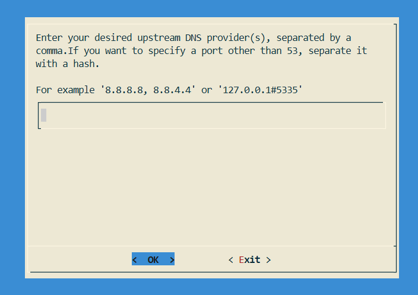
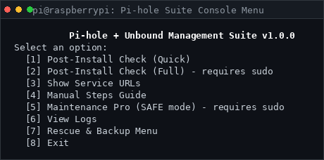
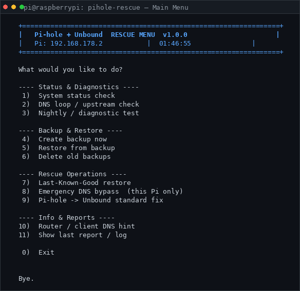
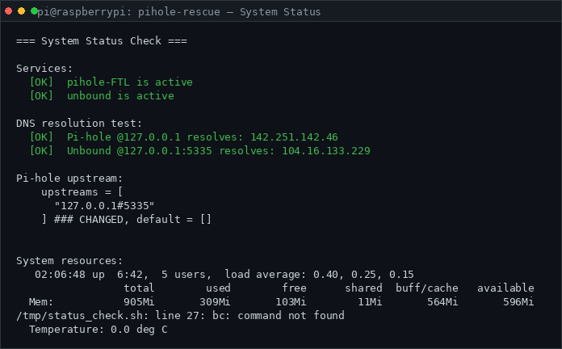
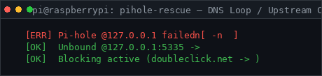
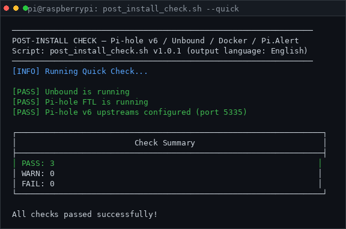

<div align="center">

# 🛡️ Pi-hole + Unbound

## **Ein-Klick DNS-Sicherheits-Stack**

[](LICENSE)
[](https://pi-hole.net/)
[](https://nlnetlabs.nl/projects/unbound/)
[](https://debian.org/)
[](https://python.org/)
[](https://buymeacoffee.com/timintech)


**🌐 Sprachen:** 🇩🇪 Deutsch (diese Datei) • [🇬🇧 English](README.md)

</div>

---

## ✨ Worum es geht

Ein **produktionsbereiter Installer und Management-Suite** für Pi-hole + Unbound auf dem Raspberry Pi.

**DNS-Kette:**
```
Client → Pi-hole (Port 53) → Unbound (Port 5335) → Internet
```

Pi-hole blockiert Werbung und Tracker. Unbound löst DNS-Anfragen rekursiv auf — ohne externen DNS-Resolver, mit vollständiger DNSSEC-Validierung.

---

## ⚡ Schnellstart

```bash
git clone https://github.com/TimInTech/Pi-hole-Unbound-PiAlert-Setup.git
cd Pi-hole-Unbound-PiAlert-Setup
chmod +x install.sh
sudo ./install.sh
```

> Als **normaler Nutzer** klonen (z.B. `pi`), nicht als root. Der Installer wird via `sudo ./install.sh` ausgeführt.

---

## ✅ Voraussetzungen

| Anforderung | Details |
|---|---|
| **Plattform** | Raspberry Pi 3/4/5, Debian Bookworm/Trixie (64-bit) |
| **Pi-hole** | v6.x (wird durch dieses Script installiert) |
| **Unbound** | Wird installiert und auf Port 5335 konfiguriert |
| **Python** | 3.12+ (für optionale Suite API) |
| **Nutzer** | Normaler Nutzer mit sudo |

Abhängigkeiten manuell installieren (optional):
```bash
sudo apt-get update
sudo apt-get install -y git curl jq dnsutils iproute2 openssl python3 python3-venv
```

---

## 🔴 Kritisch: Pi-hole muss Unbound als Upstream verwenden

> Ohne diese Einstellung ist das Setup funktional kaputt — DNSSEC wird umgangen und es wird ein externer Resolver genutzt.

Pi-hole muss DNS-Anfragen an Unbound auf **127.0.0.1#5335** weiterleiten.

**Prüfen via Pi-hole Admin → Settings → DNS:**



**Oder via Installer / Rescue Menu:**
```bash
sudo pihole-rescue   # Option 9: Pi-hole → Unbound Standardfix
```

---

## 🖥️ Management-Tools

Dieses Repo enthält drei komplementäre Verwaltungsinterfaces:

### 1. Console Menu (`scripts/console_menu.sh`)

Allgemeines interaktives Menü für die tägliche Verwaltung.

```bash
bash ~/Pi-hole-Unbound-PiAlert-Setup/scripts/console_menu.sh
# oder im Text-Modus (kein dialog):
bash ~/Pi-hole-Unbound-PiAlert-Setup/scripts/console_menu.sh --text
```



| Option | Aktion |
|--------|--------|
| 1 | Post-Install Check (Schnell) |
| 2 | Post-Install Check (Vollständig) — sudo |
| 3 | Service-URLs anzeigen |
| 4 | Manuelle Schritte-Anleitung |
| 5 | Maintenance Pro — sudo |
| 6 | Logs anzeigen |
| **7** | **Rescue & Backup Menu** |
| 8 | Beenden |

---

### 2. Rescue & Backup Menu (`scripts/rescue_menu.sh`)

Eigenständiges Wiederherstellungs- und Diagnosetool. Global aufrufbar:

```bash
sudo pihole-rescue
```



| Option | Aktion |
|--------|--------|
| 1 | Systemstatus (Services, DNS, Ports, Temperatur) |
| 2 | DNS-Loop / Upstream-Check |
| 3 | Nightly / Diagnosetest |
| 4 | Backup erstellen (pihole.toml + Unbound + systemd) |
| 5 | Backup wiederherstellen |
| 6 | Alte Backups löschen |
| **7** | **Last-Known-Good wiederherstellen** |
| **8** | **Emergency DNS Bypass** (Pi → 8.8.8.8/1.1.1.1, reversibel) |
| **9** | **Pi-hole → Unbound Standardfix** |
| 10 | Router / Client DNS-Hinweis (FritzBox-Anleitung) |
| 11 | Letzten Report / Log anzeigen |
| 0 | Beenden |

**Systemstatus:**



**DNS-Check:**



---

### 3. Maintenance Pro (`tools/pihole_maintenance_pro.sh`)

Batch-Wartungsscript (apt-Updates, Pi-hole-Update, Gravity-Update, Sicherheits-Scan).

```bash
sudo bash tools/pihole_maintenance_pro.sh
# mit Flags:
sudo bash tools/pihole_maintenance_pro.sh --no-apt --no-upgrade
```

Flags: `--no-apt`, `--no-upgrade`, `--no-gravity`, `--restart-ftl`, `--backup`, `--json`

---

## 📁 Repository-Struktur

```
Pi-hole-Unbound-PiAlert-Setup/
├── install.sh                     # Haupt-Installer
├── start_suite.py                 # Optionale REST-API (FastAPI/uvicorn)
├── requirements.txt               # Python-Abhängigkeiten
├── .env.example                   # Umgebungsvariablen-Vorlage
├── scripts/
│   ├── console_menu.sh            # Interaktives Verwaltungsmenü
│   ├── rescue_menu.sh             # Rescue & Backup Menü (sudo pihole-rescue)
│   ├── post_install_check.sh      # Post-Install-Verifikation
│   ├── nightly_test.sh            # Nächtlicher DNS/Service-Test
│   ├── repo_selftest.sh           # Repo-Integritäts-Selbsttest
│   └── lib/
│       └── ui.sh                  # Gemeinsame UI-Bibliothek
├── tools/
│   └── pihole_maintenance_pro.sh  # Batch-Wartungsscript
└── docs/
    ├── CONSOLE_MENU.md            # Vollständige Menü-Dokumentation
    └── assets/                    # Screenshots
```

---

## ⚙️ Post-Install Verifikation

```bash
# Schnellcheck (kein sudo)
bash scripts/post_install_check.sh --quick

# Vollständiger Check (sudo)
sudo bash scripts/post_install_check.sh --full
```



---

## 🆘 Rescue-Operationen

### Emergency DNS Bypass
Wenn Pi-hole oder Unbound kaputt ist und kein DNS funktioniert:

```bash
sudo pihole-rescue   # Option 8: Emergency DNS bypass
```

Setzt den Pi direkt auf 8.8.8.8/1.1.1.1. **Vollständig reversibel** — die vorherige Konfiguration wird gespeichert und kann wiederhergestellt werden.

### Last-Known-Good Wiederherstellen
Stellt das letzte bekannt-funktionierende Backup wieder her und prüft DNS:

```bash
sudo pihole-rescue   # Option 7: Last-Known-Good
```

### Backup / Restore
```bash
sudo pihole-rescue   # Option 4: Backup erstellen
sudo pihole-rescue   # Option 5: Backup wiederherstellen
```

Backups werden in `/home/pi/pihole-rescue-backups/` gespeichert und enthalten:
- `/etc/pihole/pihole.toml`
- `/etc/unbound/unbound.conf.d/`
- Systemd Drop-in Dateien

---

## 🐍 Optional: Suite REST API

`start_suite.py` ist eine **optionale** FastAPI-Anwendung für Monitoring.

```bash
# Konfiguration
cp .env.example .env
nano .env   # SUITE_API_KEY setzen

# Abhängigkeiten
python3 -m venv .venv && source .venv/bin/activate
pip install -r requirements.txt

# Starten
python3 start_suite.py
# API-Doku: http://127.0.0.1:8090/docs
```

**Nicht erforderlich** für den Kern-Stack (Pi-hole + Unbound).

---

## 🌐 Optional: NetAlertX

Netzwerk-Gerätemonitoring (separate Installation):

```bash
sudo ./install.sh --with-netalertx
```

---

## 🔧 Fehlerbehebung

### DNS funktioniert nicht
```bash
sudo pihole-rescue   # Option 2: DNS-Check, oder Option 8: Bypass
```

### Pi-hole nutzt nicht Unbound
```bash
sudo pihole-rescue   # Option 9: Pi-hole → Unbound Fix
```

### Systemstatus prüfen
```bash
systemctl status pihole-FTL unbound
dig +short @127.0.0.1 google.com
dig +short @127.0.0.1 -p 5335 google.com
```

### Vollständige Diagnose
```bash
sudo bash scripts/post_install_check.sh --full
sudo bash scripts/nightly_test.sh
```

---

## 🛡️ Sicherheitshinweise

- Die Suite API bindet standardmäßig nur an **127.0.0.1**
- Immer einen starken `SUITE_API_KEY` setzen
- Pi-hole Admin-Interface ist durch Pi-holes eigene Authentifizierung geschützt
- Unbound läuft auf Port 5335 (nicht extern erreichbar ohne explizite Konfiguration)
- Sicherheitslücken melden: [SECURITY.md](SECURITY.md)

---

## 📜 Lizenz

[MIT License](LICENSE) — © TimInTech
