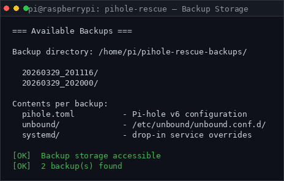

# Pi-hole Suite — Menu System Guide

> **Quick reference:** `sudo pihole-rescue` for recovery operations, `bash scripts/console_menu.sh` for general management.

---

## Overview

The suite ships two interactive menus:

| Menu | Command | Purpose |
|------|---------|---------|
| **Console Menu** | `bash scripts/console_menu.sh` | General management, checks, maintenance |
| **Rescue & Backup Menu** | `sudo pihole-rescue` | Recovery, backup/restore, DNS fixes |

Both menus use `scripts/lib/ui.sh` for consistent output formatting.

---

## Console Menu

```bash
bash ~/Pi-hole-Unbound-PiAlert-Setup/scripts/console_menu.sh
# Force text mode (bypass dialog):
bash ~/Pi-hole-Unbound-PiAlert-Setup/scripts/console_menu.sh --text
# Non-interactive check:
bash scripts/console_menu.sh --check
```


### Options

| # | Option | Details |
|---|--------|---------|
| 1 | Post-Install Check (Quick) | Fast health check, no sudo. Checks Unbound, Pi-hole FTL, upstream config |
| 2 | Post-Install Check (Full) | Comprehensive check, requires sudo. All components + network |
| 3 | Show Service URLs | Pi-hole admin URL, Suite API URL |
| 4 | Manual Steps Guide | Step-by-step verification commands with expected output |
| 5 | Maintenance Pro (SAFE mode) | Requires sudo + confirmation. apt update/upgrade, Pi-hole update, gravity |
| 6 | View Logs | Maintenance logs, pihole-FTL journal, unbound journal |
| **7** | **Rescue & Backup Menu** | Opens `pihole-rescue` — full recovery toolkit |
| 8 | Exit | |

### System-Wide Access

```bash
sudo ln -sf ~/Pi-hole-Unbound-PiAlert-Setup/scripts/console_menu.sh /usr/local/bin/pihole-suite
pihole-suite   # now works from anywhere
```

### Non-Interactive Mode

```bash
# Check mode (validates menu can start):
./scripts/console_menu.sh --check
```

Expected output:
```
[HH:MM:SS] INFO dialog not installed (optional, fallback to text menu available)
[HH:MM:SS] OK   post_install_check.sh found
[HH:MM:SS] OK   pihole_maintenance_pro.sh found
[HH:MM:SS] OK   rescue_menu found
[HH:MM:SS] INFO Console menu available (text mode)
[HH:MM:SS] OK   Console menu check completed
```

---

## Rescue & Backup Menu

```bash
sudo pihole-rescue           # global command (symlink in /usr/local/bin)
# or directly:
sudo bash scripts/rescue_menu.sh
```


### Options

#### Status & Diagnostics

| # | Option | What It Does |
|---|--------|-------------|
| 1 | System status check | Service status (pihole-FTL, unbound), DNS tests, open ports, RAM, CPU temp |
| 2 | DNS loop / upstream check | Detects DNS loops, tests blocking, verifies Unbound upstream |
| 3 | Nightly / diagnostic test | Runs `scripts/nightly_test.sh` (or inline fallback) |


#### Backup & Restore

| # | Option | What It Does |
|---|--------|-------------|
| 4 | Create backup now | Backs up `pihole.toml`, `/etc/unbound`, systemd drop-ins to `/home/pi/pihole-rescue-backups/` |
| 5 | Restore from backup | Shows list of available backups, confirms before restoring, verifies DNS |
| 6 | Delete old backups | Keeps newest or removes backups older than 14 days |



**Backup location:** `/home/pi/pihole-rescue-backups/YYYYMMDD_HHMMSS/`

**Contents per backup:**
- `pihole.toml` — Pi-hole v6 config
- `unbound/` — all files from `/etc/unbound/unbound.conf.d/`
- `systemd/` — pihole-FTL and unbound drop-in files

#### Rescue Operations

| # | Option | What It Does |
|---|--------|-------------|
| **7** | Last-Known-Good restore | Restores latest backup → sets Unbound upstream → restarts services → verifies DNS |
| **8** | Emergency DNS bypass | Sets Pi host to 8.8.8.8 / 1.1.1.1 directly. Saves previous config. Fully reversible |
| **9** | Pi-hole → Unbound standard fix | Sets upstream to `127.0.0.1#5335`, verifies Unbound config, restarts services |

**Option 8 — Emergency DNS Bypass in detail:**
1. Detects current DNS config
2. Saves it to a backup file
3. Sets `/etc/resolv.conf` to 8.8.8.8 / 1.1.1.1
4. Tests DNS resolution
5. Tells you how to revert: run option 8 again to toggle back

#### Info & Reports

| # | Option | What It Does |
|---|--------|-------------|
| 10 | Router / client DNS hint | FritzBox step-by-step guide + blocking test |
| 11 | Show last report / log | Views maintenance log, rescue session log, FTL journal |

---

## Shared UI Library (`scripts/lib/ui.sh`)

All scripts use the same log helpers:

```bash
log_ok   "message"    # [HH:MM:SS] OK   message  (green)
log_warn "message"    # [HH:MM:SS] WARN message  (yellow, stderr)
log_err  "message"    # [HH:MM:SS] ERR  message  (red, stderr)
log_info "message"    # [HH:MM:SS] INFO message  (blue)
```

Colors are automatically disabled when:
- Output is not a TTY (`| pipe`, `> redirect`)
- `NO_COLOR=1` is set

---

## Paths

| Path | Description |
|------|-------------|
| `/usr/local/bin/pihole-rescue` | Global symlink → `scripts/rescue_menu.sh` |
| `/home/pi/pihole-rescue-menu` | User alias |
| `/home/pi/pihole-rescue-backups/` | Backup storage |
| `/var/log/pihole-rescue-menu.log` | Rescue menu session log |
| `/var/log/pihole_maintenance_pro_*.log` | Maintenance Pro logs |

---

## Troubleshooting

**Menu doesn't start:**
```bash
chmod +x scripts/console_menu.sh scripts/rescue_menu.sh
bash -n scripts/console_menu.sh   # syntax check
```

**Rescue menu permission error:**
```bash
sudo bash scripts/rescue_menu.sh  # always needs sudo
```

**No color output:**
```bash
# Check terminal
echo $TERM
# Force color reset
source scripts/lib/ui.sh && ui_init
```
